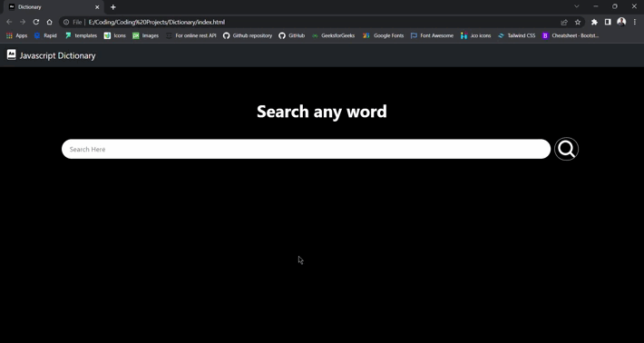

# Dictionary using Javascript and Urban Dictionary API

API Source - https://rapidapi.com/community/api/urban-dictionary/

Link of Dictionary - https://rahulgit24.github.io/Dictionary/

# Working of Application

# Features

Search any word

Get diffrenet definitions for the searched word

Get different slangs for everyword you search

# Interface of the Application

<h4> You can follow me on Instagram for various projects on web development and basic DSA questions</h4>

